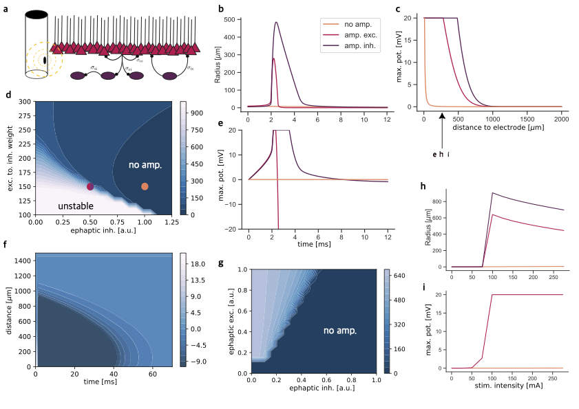
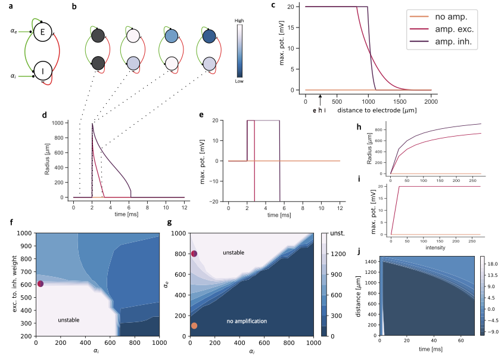
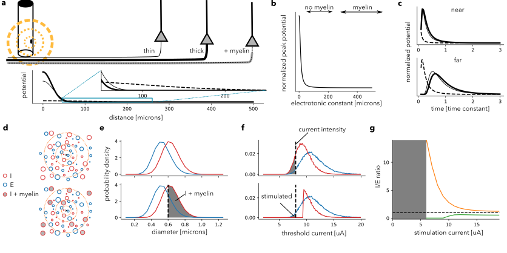

# Microstim: Axonal and Cellular Dynamics Simulation

Microstim is a scientific Python package for simulating and analyzing axonal and cellular responses to electrical stimulation. It provides a flexible framework for running a variety of models, generating plots, and exploring the effects of stimulation parameters on neural cortical tissue.

## Features

- **Cellular and Axonal Models**  
  Simulate both cell and axon responses using customizable parameters.

- **Configurable via YAML**  
  All global parameters are managed in a single `config.yaml` file for easy reproducibility and experimentation.

- **Modular Functions**  
  Run specific analyses (e.g., heatmaps, radii, intensity plots) for both cell and axon domains.

- **Command-Line Interface**  
  Launch any simulation or plot directly from the command line with flexible flags.

- **Automated Plot Generation**  
  Produce publication-ready figures and animations.

- **Extensible Architecture**  
  Easily add new models or analysis functions as the project grows.

## Installation

1. **Clone the repository**
   ```bash
    git clone https://github.com/yourusername/microstim.git
    cd microstim
   ```

2. **Create and activate a virtual environment**
   ```bash
    python -m venv venv
    source venv/bin/activate   # On Linux/Mac
    venv\Scripts\activate      # On Windows
   ```

3. **Install dependencies**
   ```bash
    pip install -r requirements.txt
   ```

## Configuration

All simulation parameters are stored in `config.yaml` at the project root. Edit this file to change model settings, stimulation parameters, or analysis options.

## Usage

Run any function using the script:
```bash  
python run.py {function} --is_depol --is_production --position 
```

Available functions
```json
{
  "cell": [
    "heatmap",
    "radii",
    "boostHeatmap",
    "gif",
    "heatmapRadiusPot",
    "intensityPotential",
    "intensityRadius",
    "maxpotPosition",
    "maxpotDistance",
    "weightsHeatmap"
  ],
  "axon": [
    "ratios",
    "distributions",
    "EI",
    "intensity",
    "map",
    "mapintensity",
    "intensitygif",
    "mapgif"
  ]
}
```
flags
```python  
--is_depol # depolarization flag
--is_production # ready to produce plots flag
--position # distance between stim and cell
```

Example
```bash
python run.py maxpotPosition --is_depol --is_prod --position 500
```

## Output

Results and plots are saved in the `results/` directory. Animations and figures are automatically generated for supported functions.

## Project Structure
```arduino
microstim/
│── axon.py
│── utils.py
│── config.yaml
│── run.py
│
├── cell/
│   ├── heatmap.py
│   ├── radii.py
│   └── ...
│
├── axon/
│   ├── distributions.py
│   └── ...
│
└── plot/
    └── results/
```

## Assets




